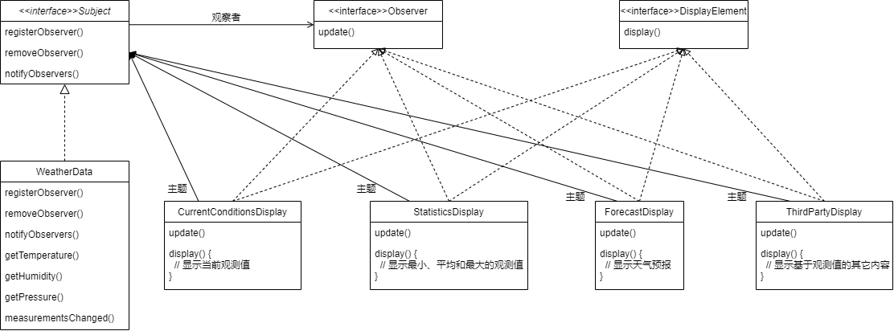
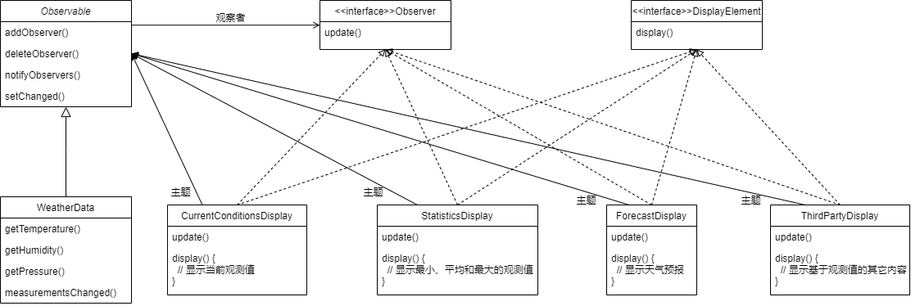

# 观察者模式

## 定义

观察者模式定义了对象之间的一对多依赖，这样一来，当一个对象改变状态时，它的所有依赖者都会收到通知并且自动更新。


## 示例

### Internet气象观测站

#### 背景

该气象站必须建立在WeatherData对象上，应用有三种布告板，分别显示目前的状况、气象统计及简单的预报。当WeatherObject对象获得最新的测量数据时，三种布告板必须实时更新。

#### 需求

该项目的工作就是建立一个应用，利用WeatherData对象取得数据，并更新三个布告板：目前状况、气象统计和天气预报。

#### 错误示范

```java
public class WeatherData {
    // 实例变量声明
    public void measurementsChanged() {
        float temp = getTemperature();
        float humidity = getHumidity();
        float pressure = getPressure();
        
        currentConditionsDisplay.update(temp, humidity, pressure);
        statisticsDisplay.update(temp, humidity, pressure);
        forecastDisplay.update(temp, humidity, pressure);
    }
}
```

上述示范存在的问题：

1. 针对具体实现编程，而非针对接口；
2. 对于每个新的布告板，我们都得修改代码；
3. 无法在运行时动态地增加或删除布告板；
4. 尚未封装改变的部分。

#### 解决方案

使用观察者模式来设计，简单来说，出版者+订阅者=观察者模式。设计类图如下：



也可使用Java内置的观察者模式进行改造：



使用Java内置的java.util.Observable有些问题：

1. Observable是一个类，必须设计一个类继承它，若某类想同时具有Observable类和另一个超类的行为，就无法实现；
2. Observable是一个类，无法建立自己的实现，和Java内置的Observer API搭配使用。比如setChanged()方法被保护起来了，意味着除非你继承Observable，否则无法创建Observable实列并组合到自己的对象中来。违反了设计原则：“多用组合，少用继承”。


### JButton

JButton的超类AbstractButton，有许多增加与删除倾听者（listener）的方法，这些方法可以让观察者感应到Swing组件的不同类型事件。


### Spring事件驱动模型

可参考[JavaGuide-Spring设计模式总结-观察者模式](https://javaguide.cn/system-design/framework/spring/spring-design-patterns-summary.html#spring-%E4%BA%8B%E4%BB%B6%E9%A9%B1%E5%8A%A8%E6%A8%A1%E5%9E%8B%E4%B8%AD%E7%9A%84%E4%B8%89%E7%A7%8D%E8%A7%92%E8%89%B2)部分章节。
