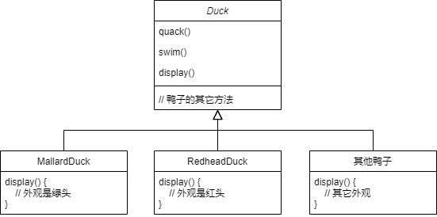
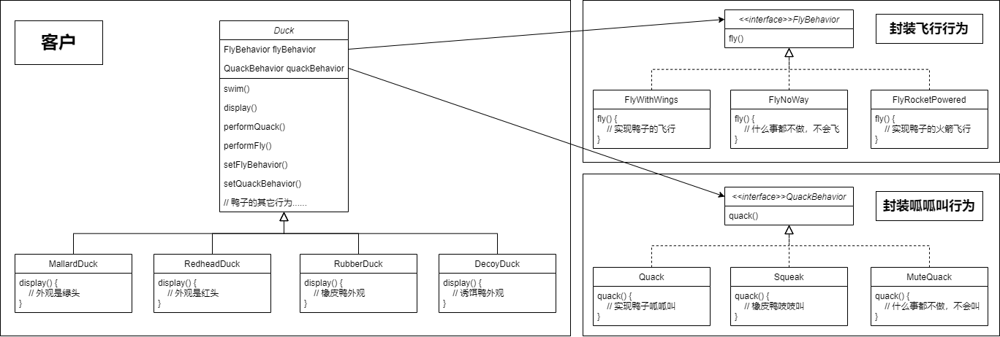

# 策略模式

## 定义

策略模式定义了算法族，分别封装起来，让它们之间可以互相替换，此模式让算法的变化独立于使用算法的客户。

## 设计原则

1. 找出应用中可能需要变化之处，把它们独立出来，不要和那些不需要变化的代码混在一起。
2. 针对接口编程，而不是针对实现编程。
3. 多用组合，少用继承。

## 示例

### 鸭子模拟器

#### 背景

Joe上班的公司做了一套相当成功的模拟鸭子游戏：SimUDuck。游戏中会出现各种鸭子，一边游泳戏水，一边呱呱叫。此系统的内部设计使用了标准的OO技术，设计了一个鸭子超类，并让各种鸭子继承此超类。

#### 新需求

1. 需要会飞的鸭子
2. 鸭子的叫声可能会不一样（如橡皮鸭不会呱呱叫quack，而是吱吱叫squeak）
3. 以后若加入诱饵鸭，它是木头假鸭，不会飞也不会叫

#### 使用继承带来的问题

1. 代码在多个子类中重复
2. 运行时的行为不容易改变
3. 很难知道所有鸭子的全部行为
4. 改变会牵一发动全身，造成其他鸭子不想要的改变

#### 解决方案

1. 分开变化和不会变化的部分；
2. 设计、封装、实现鸭子的行为；
3. 多用组合

最终设计类图如下：

